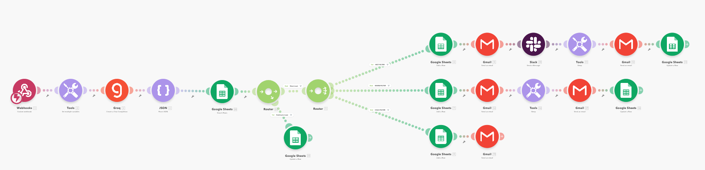
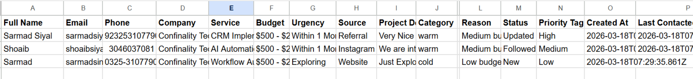
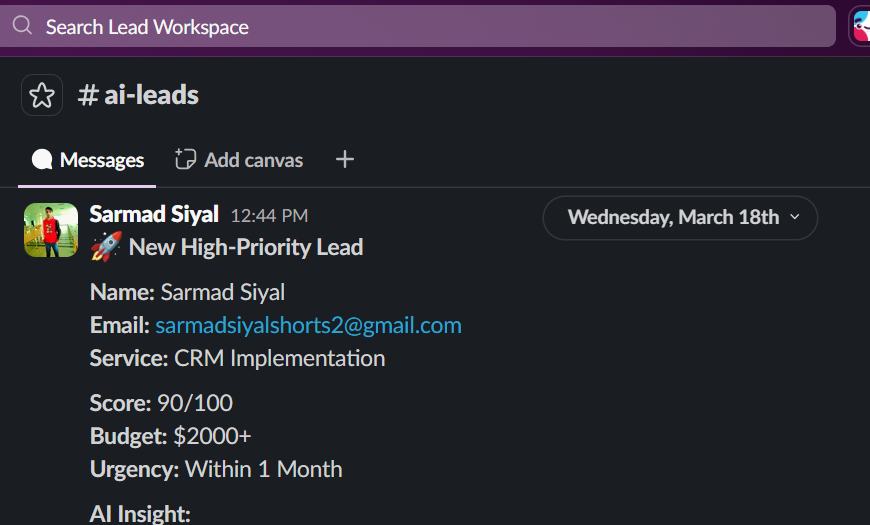

## AI Lead Qualification & CRM Automation System

## 🧾 1. PROJECT OVERVIEW
This project is an automated lead management system built using Make.com, integrating AI-based lead qualification, CRM logging, and automated communication workflows.
The system captures user inquiries through a web form, analyzes them using AI, classifies leads into categories (Hot, Warm, Cold), and performs automated actions such as notifications, follow-ups, and CRM updates.

## 🎯 OBJECTIVES
1. Automate lead qualification using AI
2. Reduce manual effort in lead handling
3. Improve response time
4. Ensure no lead is missed
5. Enable structured CRM tracking
6. Implement real-time alerts

## 🏗️ SYSTEM ARCHITECTURE
Web Form → Webhook → Variables → AI (Groq) → JSON Parser → Duplicate Check → Router

- **HOT** → CRM → Alerts → Follow-up → Update CRM
- **WARM** → CRM  → Email → Follow-up → Update CRM
- **COLD** → CRM

## 📥 INPUT (WEB FORM)
Fields:
- Full Name
- Email
- Phone
- Company
- Service
- Budget
- Urgency
- Source
- Project Details

## 🤖 AI PROCESSING
AI analyzes:
- Budget
- Urgency
- Service
- Message
Outputs:
- Category (Hot/Warm/Cold)
- Score (0–100)
- Reason
  
## 🔄 DUPLICATE DETECTION
The system checks if the email already exists in CRM.
- If exists → Update existing record
- If new → Continue workflow
  
## 🔀 ROUTING LOGIC
# 🔴 HOT LEADS
Criteria:
- High budget
- Urgent
- Clear requirement
Actions:
- Store in CRM
- Send email alert
- Send Slack notification
- Send follow-up after 24h
- Update CRM status

# 🟡 WARM LEADS
Criteria:
- Medium intent
Actions:
- Store in CRM
- Send acknowledgement email
- Follow-up after delay
- Update CRM
  
# 🔵 COLD LEADS
Criteria:
- Low intent
Actions:
- Store in CRM
- Send minimal response

 ## 📊 CRM STRUCTURE (GOOGLE SHEETS)
Columns:
- Full Name
- Email
- Phone
- Company
- Service
- Budget
- Urgency
- Source
- Project Details
- Category
- Score
- Reason
- Status
- Priority Tag
- Created At
- Last Contacted
  
## 📢 9. NOTIFICATION SYSTEM
Email Alerts
- HOT leads trigger immediate alert
Slack Alerts
- Real-time team notifications
  
## ⏱️ 10. FOLLOW-UP AUTOMATION
- **HOT:** after 24 hours
- **WARM:** after 48 hours
Purpose:
- Increase conversion rate
- Maintain engagement

## 🔁 11. CRM UPDATE SYSTEM
After follow-up:
- Status → Updated
- Last Contacted → Timestamp
  
## ⚠️ 12. ERROR HANDLING
If any module fails:
- Error handler triggers
- Email alert sent
Ensures system reliability.
  
## 🚀 13. KEY FEATURES
- AI-based lead scoring
- Automated routing
- CRM automation
- Duplicate prevention
- Real-time alerts
- Follow-up automation
- Error monitoring

## 🖼 Screenshots

### 🧠 Lead Routing Workflow

 

### 📊 CRM Data (Google Sheets)

 

### 🔔 Slack Notification System

## 💼 14. BUSINESS VALUE
- Saves time
- Improves lead conversion
- Enhances response speed
- Provides structured data
- Scalable system

## 📂 Workflow File

The exported automation blueprint is available inside:

workflow/AI Lead Qualification & CRM Automation System.json

To use:

1. Download JSON file
2. Follow the Setup Instructions
  
## ⚙ Setup Instructions
1. Import blueprint into Make.com
2. Connect Webhook
3. Add Groq API key
4. Connect Google Sheets
5. Configure Slack notifications
